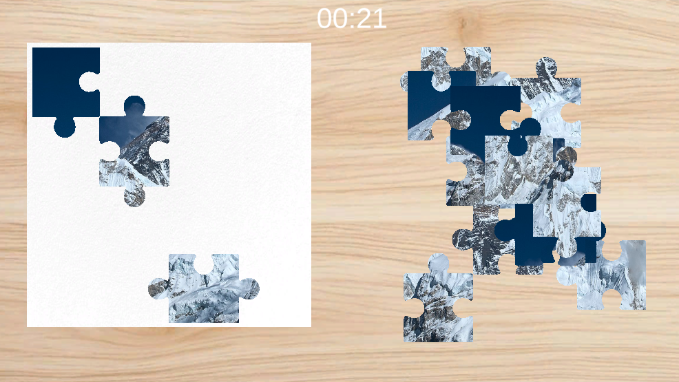

# Jigsaw Puzzle game

This is a simple jigsaw puzzle game implemented in Unity using C#. The game contains one 4x4 puzzle with 16 pieces. The objective is to drag and drop the pieces to their correct positions on the board.

## Features
- Drag and drop functionality for puzzle pieces
- Correct piece placement detection (when incorrect, the piece will return to pile)
- Timer to track the time taken to complete the puzzle

## Screen shots

